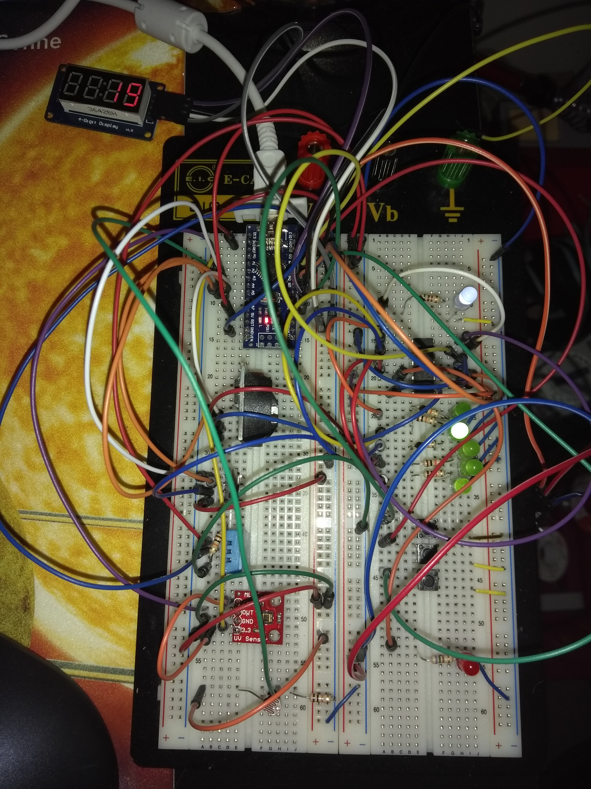

# weatherstation - README

This is the source code of the Arduino Nano based weather station
I'm working on at the moment. The project is still in progress and
just for fun!

Kindly note that the schematic in the documentation folder isn't
up-to-date.
