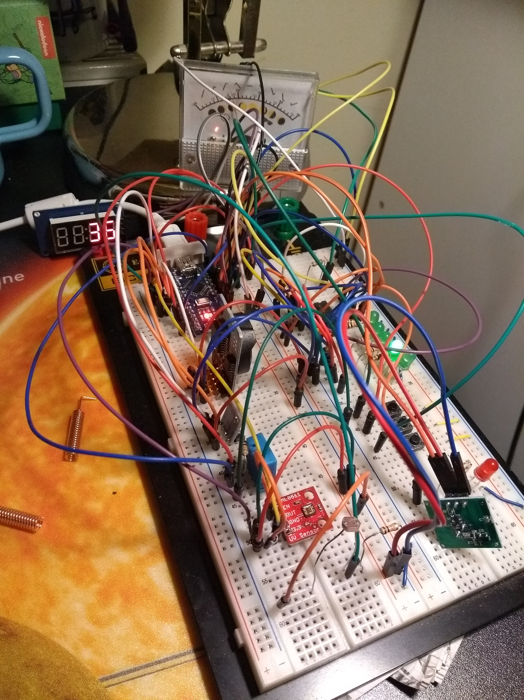

# weatherstation - README

This is the source code of the Arduino Nano based weather station
I'm developing at the moment. The project is still under
construction.

The station measures temperature, atmospheric pressure, humidity
and UV intensity. Data is stored using delta compression and sent
over 433mhz in a regular interval.

Pressing a button the weather station shows the current measurement
on a 7-segment display and a customized analog voltmeter.

This is how the prototype looks like at the current stage:

